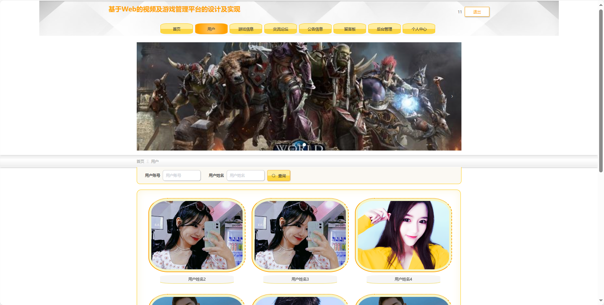
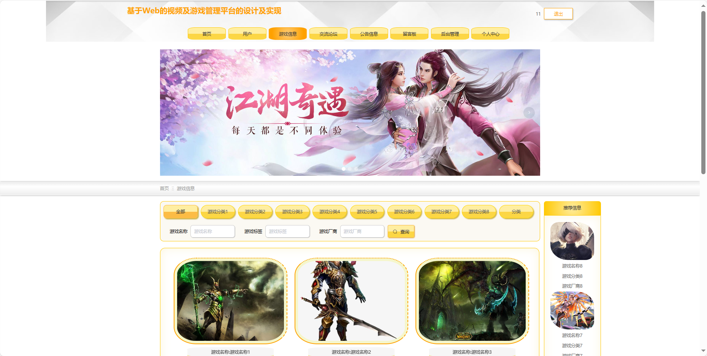
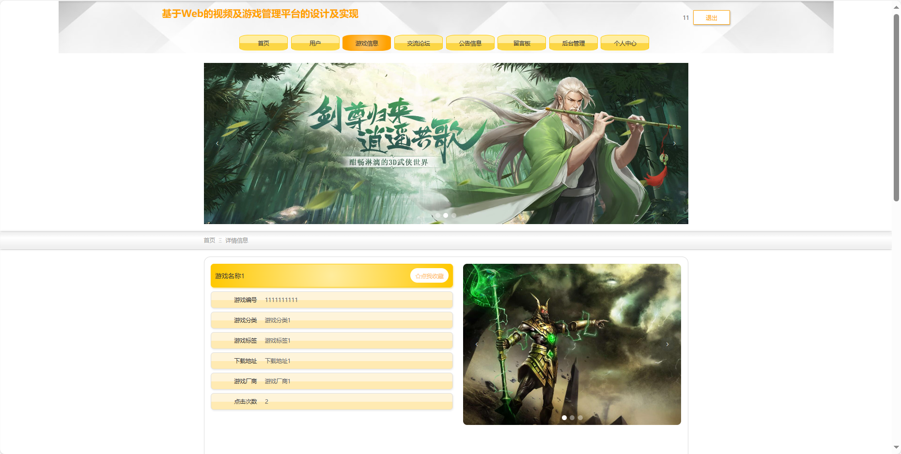
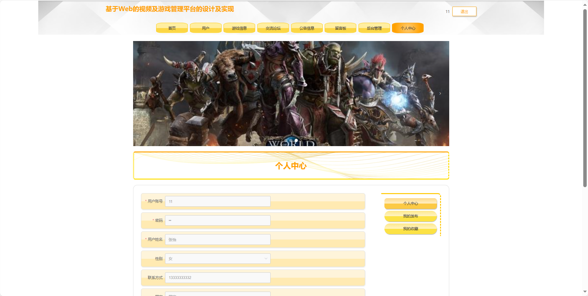

基于Springboot的视频及游戏管理平台
=
### 完整代码获取地址：从戎源码网 ([https://armycodes.com/](https://armycodes.com/))
### 作者微信：19941326836  QQ：952045282 
### 承接计算机毕业设计、Java毕业设计、Python毕业设计、深度学习、机器学习
### 选题+开题报告+任务书+程序定制+安装调试+论文+答辩ppt 一条龙服务
### 所有选题地址https://github.com/nature924/allProject

一、项目介绍
---
基于Spring Boot框架实现的视频及游戏管理平台，系统包含两种角色：管理员、用户主要功能如下。
### 【用户功能】

首页：浏览视频及游戏管理平台的主要信息。
用户：查看和编辑个人信息，包括用户名、头像等。
游戏信息：浏览平台上的游戏信息，包括详情和评价。
交流论坛：参与用户间的讨论和交流。
公告信息：阅读系统发布的相关通知和公告。
留言板：留下对游戏或系统的留言和反馈。
后台管理：进行系统首页、个人中心、好友信息管理等操作。

### 【管理员功能】
系统首页：查看视频及游戏管理平台整体概况和关键数据。
个人中心：修改密码、管理个人信息。
用户管理：审核和管理注册用户的信息。
游戏分类管理：管理平台上游戏的分类信息。
游戏信息管理：监管和管理平台上游戏的详细信息等。
好友信息管理：管理用户间的好友关系，等。
留言板：查看和管理用户在留言板上的留言。
交流论坛：监管和管理平台上的交流论坛等。
系统管理：管理系统的基本设置。

二、项目技术
---
- 编程语言：Java
- 数据库：MySQL
- 项目管理工具：Maven
- 前端技术：VUE、HTML、Jquery、Bootstrap
- 后端技术：Spring、SpringMVC、MyBatis

三、运行环境
---
- 操作系统：Windows、macOS都可以
- JDK版本：JDK1.8以上都可以
- 开发工具：IDEA、Ecplise、Myecplise都可以
- 数据库: MySQL5.7以上都可以
- Tomcat：任意版本都可以
- Maven：任意版本都可以

四、运行截图
---

### 程序截图：

